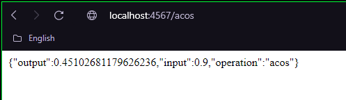
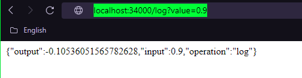

# PARCIAL - AREP - 2

Diseñé, construya y despliegue los siguientes servicios en un microcontenedor docker desplegado en una instancei a EC2 de AWS y otro desplegador en AWS lambda con AWS gateway. Cada estudiante debe seleccionar para desarrollar dos funciones matemáticas de acuerdo a los dos últimos dígitos de su cédula como se especifica en la lista (Si sus dos últimos dígitos de su cédula son el mismo use el siguiente dígito que sea diferente). Todas las funciones reciben un solo parámetro de tipo "Double" y retornan una parámetro de tipo "Double".


0. log

1. ln

2. sin

3. cos

4. tan

5. acos

6. asin

7. atan

8. sqrt

9. exp (el número de eauler elevado ala potendia del parámetro)


Implemente los servicios para responder al método de solicitud HTTP GET. Deben usar el nombre de la función especificado en la lista y el parámetro debe ser pasado en la variable de query con nombre "value".


Ejemplo de una llamado:

EC2
https://amazonxxx.x.xxx.x.xxx:{port}/cos?value=3.141592

Lambda + API Gateway
https://amazonxxx.x.xxx.x.xxx/sin?value=3.141592

## Prerequisitos

Conocimientos básicos sobre operaciones de docker, aws y spark

## Comandos
Para compilar y correr las pruebas: ```mvn package```

Para ejecutar y utilizar el programa: ```mvn exec:java -Dexec.mainClass="edu.escuelaing.arep.app.App```

Para ejecutar las pruebas: ```mvn test```

Para generar javadoc con maven: ```mvn javadoc:javadoc```

Para generar javadoc de las pruebas: ```mvn javadoc:test-javadoc```

**IMPORTANTE:** Para poder utilizar el aplicativo es necesario compilar primero el proyecto con **mvn package**.

# Video de usabilidad API - AWS Docker

https://drive.google.com/file/d/1FdNWuvldklV-REMoS0ELXsyF9Vbfy-qt/view?usp=sharing

# Despliegue AWS - log

http://ec2-3-83-14-117.compute-1.amazonaws.com:34000/log?value=0.9


# Despliegue AWS - acos

http://ec2-3-83-14-117.compute-1.amazonaws.com:34000/acos?value=0.9

# Despliegue API - acos

https://3vinaaepw9.execute-api.us-east-1.amazonaws.com/acos?value=0.8

# Despliegue API - log

https://r83ewxcdxb.execute-api.us-east-1.amazonaws.com/log?value=0.8

## Version local


## Version Aws


## Operaciones
Para poder ejecutar alguna operacion se tendra que colocar la operacion y el valor como en el siguiente ejemplo:
*https://intense-badlands-44966.herokuapp.com/operation?operation=cos&number=15* En este caso **operation** es la operacion y hace **cos**. Por otro lado **number** tiene el valor de **15**.
```
Arcoseno de 0.9
- http://ec2-3-83-14-117.compute-1.amazonaws.com:34000/acos?value=0.9
Log de 0.9
- http://ec2-3-83-14-117.compute-1.amazonaws.com:34000/log?value=0.9
```

**NOTA:** Para realizar estas operaciones se utilizo una lista encadenada propia del programa, no se utilizo ninguna implementación por defecto como ArrayList.

## Intalación
Si quieres saber como funciona el programa, tienes que seguir los siguientes pasos:
1. Descargar eclipse (última versión) o cualquier editor de JAVA.
2. Abra el proyecto en el editor.
3. Corra el programa y verifique que no tiene errores.
4. Ingrese los parámetros deseados que desea ver para visualizar las funcionalidades del sistema.

## Instalación (Proyecto Maven)
Para tener una mejor experiencia con el programa, es recomendable tener instalado maven en el sistema operativo,
de esta forma se puede visualizar de una mejor manera las pruebas y ejecutarlas desde consola.
Para instalar maven seguimos los siguientes pasos:
1. En eclipse vamos al menu que dice help.
2. Ahí le damos a install new software.
3. Nos abrirá una nueva pestaña, allí le damos donde aparece "add".
4. En "Name" escribimos lo siguiente: M2Eclipse
5. En "Location" escribimos la siguiente dirección: http://download.eclipse.org/technology/m2e/releases
6. Le damos Add, señalamos los plugins que aparecieron.
7. Aceptamos los terminos y condiciones, y se instalará automáticamente.
8. Reiniciamos eclipse y ya está instalado maven en eclipse.


## Clase de Calculadora
```java

package edu.escuelaing.arep.app.operation;

public class Calculator {
   public double number;
   public String operation;

   public Calculator(double number, String operation){
      this.number = number;
      this.operation = operation;
   }

   public double getResultOperation(){
      double res = 0;
      //System.out.println(number + "operacion");
      if(operation.equals("sin")){
         res = Math.sin(number);
      }else if (operation.equals("cos")){
         res = Math.cos(number);
      }else if (operation.equals("tan")){
         res = Math.tan(number);
      }
      //System.out.println(res + "RES CALCUL");
      return res;
   }

}
```

## ¿Cómo usar el aplicativo?
1. Copie el enlace proporcionado por el git del proyecto y clone el repositorio en el directorio de su preferencia.

    - git clone https://github.com/Nikolai9906/AREP-LAB-1.git
2. Entre a la carpeta **arep-lab-1**.
3. Compile el proyecto antes de comenzar a utilizar sus funcionalidades.

    - **NOTA:** Recuerde que el proyecto se compila con el comando **mvn package**.
4. Cree un archivo en ese directorio con la lista de números a la cuál le desea calcular la media y la desviación estándar.
5. Ejecute el programa con la lista que creo anteriormente y compare los resultados.

## Ejemplos de uso con maven
Para ello nos dirigimos a la carpeta principal del proyecto, dependiendo de lo que queramos hacer.

Si queremos compilar el proyecto y ver que no tiene fallos, utilizamos el comando **mvn package**.

Si queremos ejecutar las pruebas y ver que todo está perfecto, utilizamos el comando **mvn test**.

**NOTA:** El comando **mvn package** compila y ejecuta las pruebas al mismo tiempo.

## Construido
[IntelliJ IDEA](https://www.jetbrains.com/es-es/idea/) Editor de JAVA donde se puede compilar el proyecto.

[Spark](https://sparkjava.com) Framework Spark

## Autor
Steven Nikolai Bermudez Vega - Parcial de Programacion AREP 2 03/26/2021

## Licencia
Este programa es de uso libre, puede ser usado por cualquier persona.

